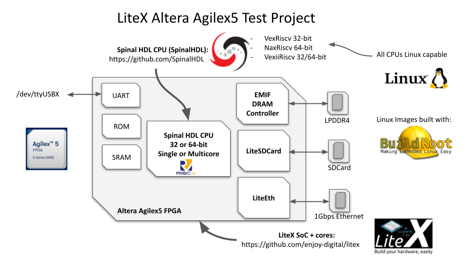
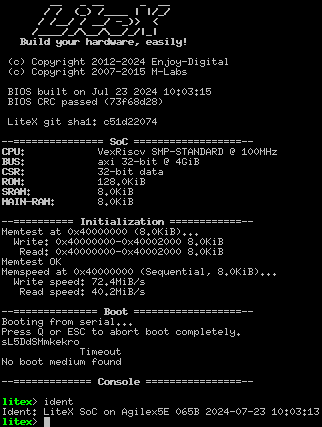
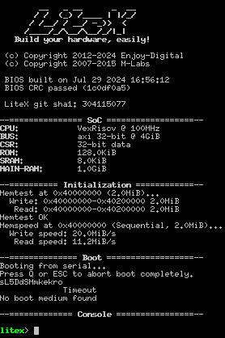

                 __   _ __      _  __    ___       _ __         ____    ______        __
                / /  (_) /____ | |/_/___/ _ |___ _(_) /____ __ / __/___/_  __/__ ___ / /_
               / /__/ / __/ -_)>  </___/ __ / _ `/ / / -_) \ //__ \/___// / / -_|_-</ __/
              /____/_/\__/\__/_/|_|   /_/ |_\_, /_/_/\__/_\_\/____/    /_/  \__/___/\__/
                                           /___/
                        Initial Test/Support of LiteX on Intel Agilex5 FPGAs.
                             Developed by Enjoy-Digital for Intel.

[> Intro
--------

This project aims to integrate and test LiteX support on Agilex5 FPGAs, with the objective of
booting various Linux-capable SoCs. Different CPUs already supported by LiteX will be evaluated,
and resource usage will be compared across different FPGA architectures.

To facilitate Linux testing and demonstrate the use of additional LiteX cores and peripherals,
support for the following board peripherals will be added:
- LPDDR4 EMIF integration as an AXI-4 DRAM controller.
- LiteSDCard support.
- LiteEth support.

<p align="center"></p>


[> Configs/Resource Usage
-------------------------

| CPU Name           | soc.json                                                                  | .sof                                                                                                          | sdcard.img                                                                         | Resource Usage Report                                                                                                 |  ALMs  | RAMs | DSPs |
|--------------------|---------------------------------------------------------------------------|---------------------------------------------------------------------------------------------------------------|------------------------------------------------------------------------------------|-----------------------------------------------------------------------------------------------------------------------|--------|------|------|
| Vexriscv-32-bit    | [soc.json](https://github.com/user-attachments/files/16438498/soc.json)   | [sof](https://github.com/user-attachments/files/16438510/intel_agilex5e_065b_premium_devkit_platform.sof.zip) | [sdcard.img](https://github.com/user-attachments/files/16438517/sdcard.img.zip)    | [fit.rpt](https://github.com/user-attachments/files/16438546/intel_agilex5e_065b_premium_devkit_platform.fit.rpt.txt) | 11,840 |  57  |   7  |
| NaxRiscv-32-bit    | [soc.json](https://github.com/user-attachments/files/16440816/soc.json)   | [sof](https://github.com/user-attachments/files/16440820/intel_agilex5e_065b_premium_devkit_platform.sof.zip) | [sdcard.img](https://github.com/user-attachments/files/16440880/sdcard.img.zip)    | [fit.rpt](https://github.com/user-attachments/files/16440825/intel_agilex5e_065b_premium_devkit_platform.fit.rpt.txt) | 28,547 |  148 |   7  |
| VexiiRiscv-32-bit  | [soc.json](https://github.com/user-attachments/files/16442400/soc.json)   | [sof](https://github.com/user-attachments/files/16442401/intel_agilex5e_065b_premium_devkit_platform.sof.zip) | [sdcard.img](https://github.com/user-attachments/files/16442415/sdcard.img.zip)    | [fit.rpt](https://github.com/user-attachments/files/16442410/intel_agilex5e_065b_premium_devkit_platform.fit.rpt.txt) | 10,148 |  87  |   2  |
| VexiiRiscv-64-bit  | [soc.json](https://github.com/user-attachments/files/16443039/soc.json)   | [sof](https://github.com/user-attachments/files/16443041/intel_agilex5e_065b_premium_devkit_platform.sof.zip) | [sdcard.img](https://github.com/user-attachments/files/16443120/sdcard.img.zip)    | [fit.rpt](https://github.com/user-attachments/files/16443115/intel_agilex5e_065b_premium_devkit_platform.fit.rpt.txt) | 11,520 |  90  |   8  |

[> Getting started
------------------

#### [> Installing LiteX:

Install LiteX by following the instructions provided on the LiteX Wiki:

[LiteX Installation Instructions](https://github.com/enjoy-digital/litex/wiki/Installation)

[LiteX AXI Verilog Test](https://github.com/enjoy-digital/litex_verilog_axi_test) must also be installed:

```bash
cd gateware
git clone --recursive https://github.com/enjoy-digital/litex_verilog_axi_test
cd litex_verilog_axi_test
cd verilog_axi/verilog/ && git apply ../../../verilog_axi_adapter_rd.patch
cd ../../
pip3 install --user -e .
```

#### [> Installing the RISC-V toolchain for the Soft-CPU:

To install the RISC-V toolchain, follow the manual installation steps or use the instructions from
the LiteX Wiki:

```bash
./litex_setup.py --gcc=riscv
```

#### [> Cloning the Repository

Clone the project repository with all its submodules using the following command:

```bash git clone git@github.com:enjoy-digital/litex_agilex_test.git --recursive ```


[> Build the Gateware
---------------------

### [> Build Commands

- `--with-spi-sdcard`: enable SDCARD support in SPI mode (can't be used at the same time as `--with-sdcard`)
- `--with-sdcard`: enable SDCARD support in SDCARD mode (can't be used at the same time as `--with-spi-sdcard`)
- `--with-ethernet`: enable ethernet support. `--eth-ip` may be used to change default board IP and `--remote-ip` must be
  adapted to the host computer IP

### [> Standard Build

**Basic mode (vexriscv CPU, BRAM):**

```bash
./intel_agilex5e_065b_premium_devkit.py --build --integrated-main-ram-size=1024
```

<p align="center"></p>

**DR mode (vexriscv CPU, DDR):**

```bash
./intel_agilex5e_065b_premium_devkit.py --build
```

<p align="center"></p>

[> Build the Linux Image
------------------------

This repository provides a script, called `make.py`, that can build the gateware and the software components (using *buildroot* for software).

### [> Usage

To run the script, use the following command:
```bash
./make.py --config=CONFIG --build-gateware --build --generate-dtb [--rootfs=xxxx] [--soc-json=somewhere/soc.json]
```

**Options**

- `--config=CONFIG`: specifies the Configuration to use. **CONFIG** must be one of the following:
  - **vexriscv**,
  - **naxriscv_32**,
  - **vexiiriscv_32**
  - **vexiiriscv_64**
- `--build-gateware`: builds first the gateware. The (`--config` argument is required when using this option
- `--build`: clones, configures and builds the root filesystem image, the bootloader and the kernel using *buildroot*
- `--generate-dtb`: converts the *soc.json* to *soc.dts* and produces the *soc.dtb*
- `--rootfs` (optional, default: *ram0*): specifies the root filesystem. The user can select between a ramdisk (*ram0*) or the second SDCard partition (*mmcblk0p2*)
- `--soc-json`: provides the path to the *soc.json*.This option is only required when `--build-gateware` is not used

[> Boot Linux from Serial
-------------------------

Once both the gateware and software have been successfully built, all required files are present in *images* directory:
- *boot.json*
- *Image*
- *rootfs.cpio*
- *soc.dtb*
- *opensbi.bin*

To boot using `serialboot` use the following command:
```bash
litex_term /dev/ttyUSB1 --image images/boot.json
```

*NOTE:* with the default UART baudrate, downloading all files takes time: to reduce this delay `--uart-baudrate` must be
used with a value like `1000000`.

[> Boot Linux from SDCard
-------------------------

Once both the gateware and software have been successfully built, an image named *sdcard.img* will be generated and
located in *images* sub-directory. To write this image to the SDCard, use the following command:

 ```bash
 sudo dd if=images/sdcard.img of=/dev/sdXXX bs=4M status=progress
 ```

 **WARNING: using `dd` with the wrong device may erase the hard driver content. Ensure you have correctly identified the SDCard device before executing this command.**